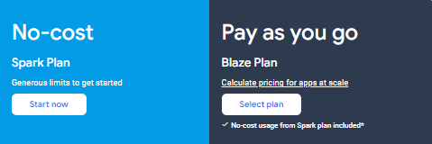
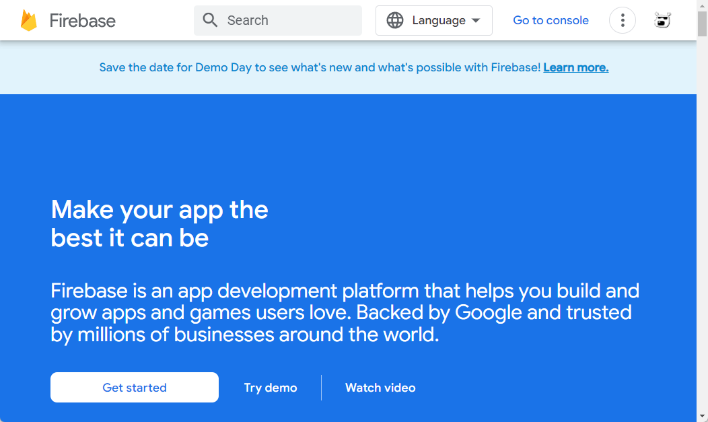
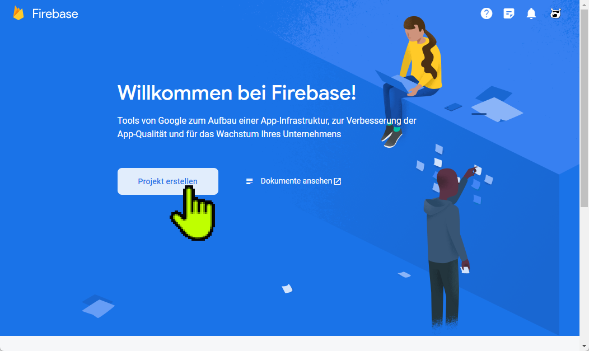
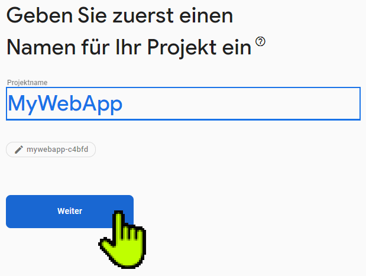

# Firebase Projekt erstellen #

[**Zurück zum Haupttutorial**](tutorial.md)

Firebase bietet zahlreiche Dienste für Ihr WebApp-[Projekt](https://firebase.google.com/docs/projects/learn-more?hl=de) an:

* Datenbankdienst
* Datenspeicherung
* Benutzerauthentifizierung
* Hosting
* Testumgebung
* Benachrichtigungen

...und vieles mehr

Um die Dienste von Firebase zu nutzen müssen Sie mit Ihrem Google-Konto in irgendeiner App von Google angemneldet sein.

Firebase hat 2 Preismodelle:

Sie verwenden in dieser Übung ausschließlich den Spark Plan (No-Cost). **Bitte beachten Sie**, dass eine Skalierung oder verlassen der Übungsparameter zu Kosten führen kann!

## Firebase Projekt

Sobald man in [Firebase](https://firebase.google.com/) ist kann man entweder gleich in die [Konsole](https://console.firebase.google.com/) oder auf "Get Started" gehen.

Wenn man **neu in Firebase ist oder keine Projekte** hat, dann sieht das Fenster in etwa so aus:

Legen Sie ein **neues Projekt** an! Wählen Sie einen Namen für Ihr Projekt!

Aktivieren Sie die **Analysewerkzeuge**.

Erstellen Sie ein **Profil/Konto** für Analysedaten.

Lesen und akzeptieren Sie die **Geschäftsbedingungen** und erstellen Sie das Projekt!

Nun wird das Projekt vorbereitet ...

... und Sie landen auf der **Verwaltungsoberfläche ("Console")**

Mit einem **Klick auf das Firebase Logo** sehen Sie einen **Überblick** zu Ihren Projekten

[**Zurück zum Haupttutorial**](tutorial.md)

